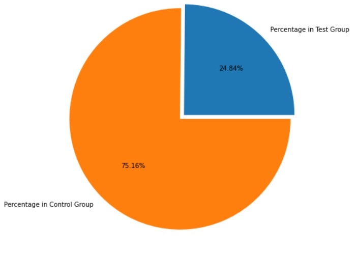
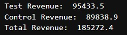
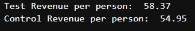
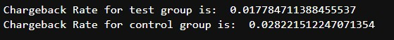

# Report for Seedbox Technical Challenge

## Introduction

Seedbox recently ran an A/B test on the cancellation page of a subscription service. Before running the test, members were able to cancel using a simple web form. The experiment aims to measure the impact of forcing members to phone Seedbox's customer service line in order to cancel.

#### Information about the test:

* The control group can cancel using a web form
* The test group can only cancel by calling in
* Users were randomly assigned to a group when they go to the website cancel page for the first-time
* The distribution probability between both groups is uneven (you can see this like an unfair coinflip)
* We've recorded additional transactions generated after users were randomized
* REBILLs are Transactions recurring payments that were processed
* CHARGEBACKs or REFUNDs transactions represent payments that were cancelled

### Questions Answered

1. What is the approximate probability distribution between the test group and the control group?
1. Is a user that must call in to cancel more likely to generate at least 1 additional REBILL?
1. Is a user that must call in to cancel more likely to generate more revenues?
1. Is a user that must call in more likely to produce a higher chargeback rate(CHARGEBACKs/REBILLs)?

## Q1: What is the approximate probability distribution between the test group and the control group?

After reviewing Figure 1, one can deduce that the percentage to be in the control group is about 75% or 3 in every 4 people are put in the control group. The test group is 25% pr 1 in every 4 people. So one can take away that this was a very small rollout for the test to see if there are any positive changes to making people who want to cancel call in.

## Q2: Is a user that must call in to cancel more likely to generate at least 1 additional REBILL?

Once a T-test has been completed, one can see that the p-value is very small. Due to this result, one can safely infer that the behaviour of each group is different. The test group users are very likely to have additional rebills charged to them than if they could cancel online.

## Q3: Is a user that must call in to cancel more likely to generate more revenues?

One can observe that the total revenue generated from the test group is higher than the control group. Since one group is weighted more than the other group I decided to also look at the revenue generated per person as well.

While there is a higher percentage of people in the control group the test group is still generating more revenue per person as well.

## Q4: Is a user that must call in more likely to produce a higher chargeback rate(CHARGEBACKs/REBILLs)?

Based on the analysis above, one can see that the chargeback rate is greater in the control group than in the test group. This could mean that the test group is more likely to put off cancelling their subscription to avoid talking on the phone.

## Conclusion

After looking at all the ways the test group is generating more revenue, is behaving differently than the control group and has a lower chargeback rate. I would advise that the rollout of the test group was a success and that even more people should be added to the test group as soon as possible. People are hesitant to talk on the phone or just can't be bothered to call someone so they will be generating more revenue while they are hesitant to call to cancel their subscription. So this was a successful rollout and should be continued to more people.

**Note:** To review the Python code that accompanies this analysis, please see the Jupyter Lab (or the .ipynb file) called "AJLuck_Seedbox_Tech_Challenge", or click this link [here](https://github.com/LuckAJ/Seedbox_Tech_Challenge/blob/main/AJLuck_Seedbox_Tech_Challenge.ipynb)
